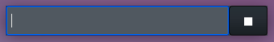
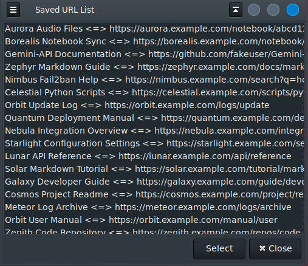
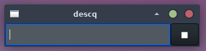
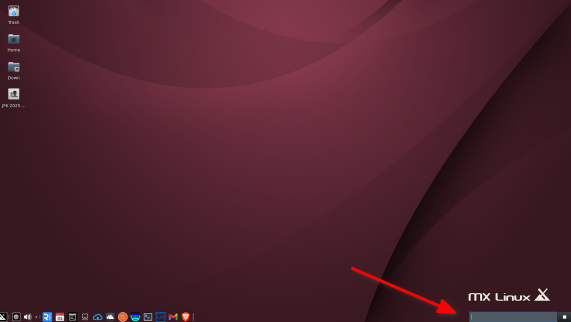
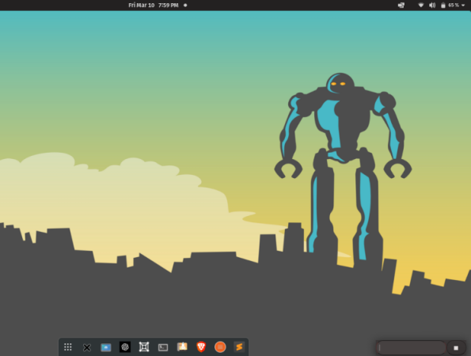

# DescQ for Linux
## Your Efficient Desktop Assistant

**DescQ for Linux** is a lightweight and powerful application designed to enhance your productivity by allowing you to **launch apps, execute system commands, and perform internet queries directly from your desktop**. This eliminates the need to open separate terminal or browser windows, saving you time and effort. Written in C, DescQ is fast and ensures minimal resource usage. Additionally, users can **create aliases** that streamline task execution by simply typing them into the entry field. Its intuitive interface enables quick access to information without navigating through multiple windows.

## Key Features

DescQ offers a range of features accessible through its intuitive interface:

*   **URL Management**:
    *   **Save URLs**: Easily store your favorite URLs for easy access later. To save a URL, copy or type it into descq and hit Enter.
    *   **Recall URLs**: Retrieve saved URLs using commands like **`list`** and **`eu`**, or through the saved URL dialog. Typing **`list`** opens a dialog with saved URLs.
    *   **Launch Multiple URLs**: Open several URLs at once directly from the entry field or the saved URLs dialog.

*   **Clipboard Management**:
    *   **Save Clipboard Text**: Store text copied to the clipboard for future use. This can be done by clicking the action button (☐), hitting Enter with an empty entry field, or typing **`sc`**.
    *   **Access Saved Text**: Retrieve and edit saved clipboard text using the **`ec`** command, which opens the **`clips.txt`** file in your configured text editor. Saved clippings will open in the text editor.

*   **Internet Searches**:
    *   **Perform Searches**: Initiate internet searches directly from the DescQ entry field. Simply type your search phrase and hit Enter.
    *   **Search History**: Maintain a history of your searches. Access and reuse previous searches using the **`hist`** command to open a dialog or the **`eh`** command to edit the **`hist.txt`** file.
    *   **Multiple Searches**: Perform multiple searches simultaneously by separating your queries with a "|" (e.g., `dogs|cats|tadpoles`).

*   **Service-Specific Searches (Website Directed Searches)**:
    *   Set up searches for specific services such as Maps, Images, Amazon, and more by editing the **`serv.txt`** file.
    *   Define a unique single-letter or number prefix followed by a name and the website URL with its query string format (e.g., `i,Google Images,http://images.google.com/images?q=`).
    *   Use these custom searches by typing the prefix followed by a colon and your search term (e.g., `i:wallpaper for Linux Mint`). Whatever you enter after `letter:` will get appended to the website querystring.

    *   Example of code from `serv.txt` file:  
    
                    ...
                    xed, xed &
                    youtube, firefox https://youtube.com &
                    zoom, https://us04web.zoom.us/meeting
                    ---- SERVICES ---- ! Do Not Remove This Line !
                    a, Amazon, https://amazon.com/s/ref=nb_sb_noss_1?field-keywords=
                    m, Google Maps, https://www.google.com/maps/search/
                    y, YouTube, https://www.youtube.com/results?search_query=
                    s, aspell, sp 
                    ...

*   **Command Execution**:
    *   **Launch Applications**: Start applications with predefined commands or by prefixing the application name with **`$`** or **`>`** (e.g., `$gedit` or `>gimp`). Directly execute an app installed on your system by prefixing it with one of these characters.
    *   **Execute System Commands**: Run system-level commands effortlessly by prefixing them with **`>`** (e.g., `>shutdown now`).
    *   **Open URLs (via command)**: Access websites directly by prefixing the URL with **`>`** (e.g., `>https://github.com`). Note that a URL without the leading `>` is saved and may be recalled with the **`list`** command.
    *   **Aliases**: Create aliases for frequently used URLs or system commands in the **`serv.txt`** file for quick access. The format is `Alias, {URL | fullpath-command-line}` (e.g., `git,https://github.com` or `dev, dev.sh`). Access these via the alias name. DescQ will match on leading character substrings of your alias.

*   **Built-in Utilities**:
    *   **Calculator**: Evaluate math expressions using a leading **`=`** followed by the expression (e.g., `=24.5^3 / 2.2`). This feature requires that "**bc**" the Linux "**Basic Calculator**" be installed on your system (`sudo apt install bc`).
    *   **Date/Time**: Display the current date and time by typing **`T`**.
    *   **Date Math**: Calculate future or past dates using a leading **`%`** followed by an offset expression (see bash **`date`** command syntax, e.g., `%+5 days`, `%-4 weeks`, `%2021-04-01 + 100 days`). The response will always be in the `%Y-%m-%d` format.
    *   **Window Positioning**:
        *   Toggle the window caption bar on and off using the **`cap`** command.
        *   Save the current window geometry and caption status using the **`winset`** command, which saves this information to **`winmet.txt`**.
        *   Fine-tune the window position and size in undecorated mode using the **`@`** command with pixel adjustments (e.g., `@top:-20`, `@left:+17`, `@width:+210`, `@height:-3`). These pixel values are added or subtracted from the current position values!
        *   Toggle the window level to be always on top or at the bottom using the **`top`** command.
    *   **Help**: View a "cheet-sheet" of available commands by typing **`help`**.

## Getting Started

1.  **Download and Extract**: Extract the ZIP file into a folder.
2.  **Run Setup**: Navigate to the extracted folder in your terminal and execute the `setupData.sh` script. This copies descq's files to `~/.config/descq/data`.
3.  **Run DescQ**: Execute the `descq` file to launch the application. Note that `descq` may be copied to any directory in the system's path.

## Using DescQ

*   **Interacting with DescQ**: Type your requests, commands, or queries into the DescQ entry field and activate them by hitting **Enter**, **Tab**, or clicking the **action-button** ☐.
*   **Saving URLs**: To save a URL, copy or type it into descq and hit Enter. A URL without the leading `>` is saved.
*   **Saving Clipboard Text**: To save text from your system clipboard, click the action button ☐ or hit Enter with the entry field empty, or type **`sc`**.
*   **Recalling Saved Items**: Use the **`list`** command to open a dialog of your saved URLs or the **`hist`** command to pop up a dialog of your saved searches. Select one or more entries and click Select. Double-click to instantly repeat one item.
*   **Editing Configuration Files**: Use the following commands to edit DescQ's configuration files in your default text editor (gedit by default):
    *   **`ec`**: edit saved clips text (**`clips.txt`**).
    *   **`eh`**: edit saved search history (**`hist.txt`**).
    *   **`es`**: edit custom command / services file (**`serv.txt`**).
    *   **`eq`**: edit the search query engine URL (**`search.txt`**).
    *   **`ee`**: edit the name of your text editor (**`editor.txt`**). The text editor is used by descq for maintaining several of its text files.

## Command Aliases and Website Searches
The **`serv.txt`** file holds your aliases with custom commands and URLs. The entries in **`serv.txt`** take two forms: Aliases and Website Directed Searches. Create your commands in **`serv.txt`** in ascending order which should allow for unique substrings.

### Aliases
 Aliases can be either URLs or system commands.

 The general format is

 **_Alias_, {URL | _fullpath-command-line_}**

 To create an alias first invent a name for
 the command. The name is simply a "key" (alias)
 that you will type to launch the command.

**examples from a `serv.txt` file:**

      git,https://github.com  
      dev, dev.sh  
      shutdown, shutdown now  
      reboot,reboot  
      drive, https://drive.google.com  

 To perform these commands in descq you would type 
 the alias and hit Enter or click the action button.
 _descq_ will match on _leading_ character substrings
 of your alias.
 >Note: if you create an alias in `serv.txt` and then
 mistype it when using it, the mistyped alias will
 be treated as a __search__ and launch it in the
 browser.

 **Using the above example aliases:**

 | type | action |
 | :---------- | :-------------------- |
 |_git_|opens github.com in your browser|
 |_dev_|executes your shell script to ... ?|
 | _shut_|shuts down your machine|
 |_shutdo_|shuts down your machine|
 |_sh_|shuts down your machine|
 |_reboot_|reboots your machine|
 |_reb_|reboots your machine|

Create your commands in `serv.txt`
in assending order which should allow for unique substrings.  
Your commands will hopefully become familiar from use.

 ---

### Website directed searches
 These are URLs that may have a ?querystring after
 the domain and path part. To setup a web directed
 search in `serv.txt` make sure that the
 first character of each line begins with
 a single letter (a-z, 1-0).

 The general format is:

 __letter,name,website-URL + query-string...__
 where _letter_ = a unique letter a-z, A-Z, 0-9

 _**You may have to experiment with each website to learn
 what format they expect for search queries**_

**Some examples:**

         a,Amazon,https://amazon.com/s/ref=nb_sb_noss_1?field-keywords=
        
         i,Google Images,http://images.google.com/images?q=
        
         p,Php,http://php.net/manual-lookup.php?pattern=
        
         m,Google Maps,https://www.google.com/maps/search/

Use like this:

        a:mini computers  
        i:wallpaper for Linux Mint  
        p:preg_split  
        m:arlington, tx  

Note that what ever you enter after __letter:__ will get
appended to the website querystring that you've set up
in `serv.txt`.

 

It may take a little work to discover some of these
querystrings but many do exist. _descq_ comes with
several already set up, but may have changed over time.

---

## Positioning DescQ on Your Desktop

1.  Type **`cap`** to toggle the window caption bar on and off.
2.  Position DescQ on your desktop.
3.  Then type **`winset`** to save the windows geometry and caption status (**`winmet.txt`**).
4.  Window/widget fine positioning can be tweaked while the window is in un-decorated mode by using the **`@`** command.
5.  When the position is correct then use the **`winset`** command to save the window position. For broader positioning use the **`cap`** command to toggle into "decorated" mode, and then drag the window around like any other window.

   

---

## Important Notes

*   DescQ does not store any browser history and bookmarks.
*   Note: if you create an alias in **`serv.txt`** and then mistype it when using it, the mistyped alias will be treated as a search and launch it in the browser.
*   It may take a little work to discover some of these querystrings but many do exist. descq comes with several already set up, but may have changed over time.
*   DescQ uses the DuckDuckGo search engine as default. Edit **`search.txt`** (or use the **`eq`** command) to change it. Restart DescQ after changing this setting. One of the advantages of DDG is its BANG query feature.
*   The default text editor is set to **`gedit`**. To change it, edit the **`editor.txt`** file and restart descq, or use the **`ee`** command. The text editor is used by descq for maintaining several of its text files.

## DescQ System Files

Here's a breakdown of the files and their purpose according to the sources:

*   **clip.txt**: Stores saved clipboard text.
*   **serv.txt**: Contains command aliases and website-directed searches.
*   **winmet.txt**: Saves the window geometry and caption status.
*   **editor.txt**: Specifies the name of the default text editor used by DescQ.
*   **urls.txt**: Stores a list of saved URLs.
*   **search.txt**: Holds the URL for the preferred search engine.
*   **hist.txt**: Contains the history of search queries.

## MX

## DescQ & Pop-OS

## LMDE

#### end

